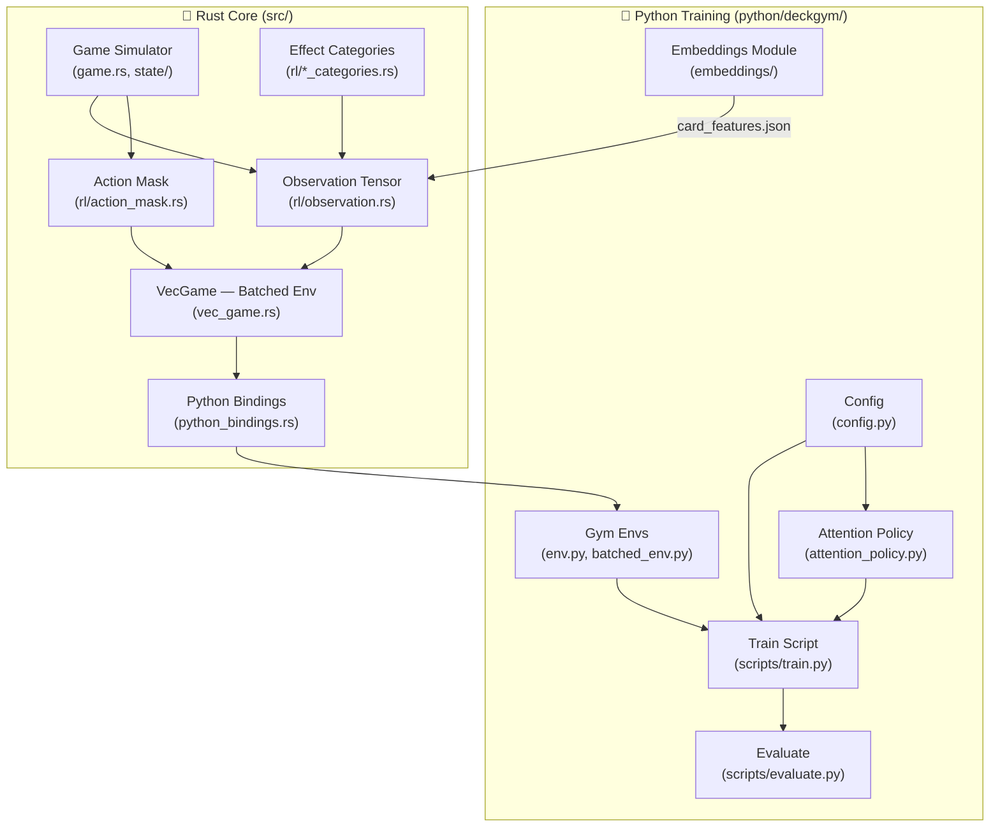

# RL Architecture — DeckGym

> Architecture summary of the Reinforcement Learning pipeline for Pokémon TCG Pocket.

---

## Overview

---

## Rust Side (`src/rl/`)

### Observation Tensor — `observation.rs` (V5)

Generates a flat `Vec<f32>` of size **OBSERVATION_SIZE** = `GLOBAL_FEATURES + MAX_CARDS_IN_OBS × FEATURES_PER_CARD`.

| Constant | Value | Description |
|---|---|---|
| `GLOBAL_FEATURES` | 171 | Turn, points, sizes, energy types, stadium |
| `MAX_CARDS_IN_OBS` | 40 | Max cards encoded per observation |
| `FEATURES_PER_CARD` | 603 | Per-card feature vector dimension |
| **OBSERVATION_SIZE** | **24,291** | Total observation vector size |

## Global features (171 dims)
- **State core (10)**: Turn count, points, deck/hand/discard sizes.
- **Energy generated (32)**: One-hot encoding of energy units available in deck slots.
- **Stadium (129)**: 1 presence flag + 128-dim text embedding of the active stadium.

## Per-card features (603 dims)

### 1. Card Base Features (42 dims)
- **HP (1)**: Raw remaining HP.
- **Type (11)**: Energy type one-hot (including None).
- **Weakness (11)**: Weakness type one-hot.
- **Flags (8)**: `ex`, `mega`, `is_pokemon`, `is_tool`, `is_trainer`, `is_item`, `is_stadium`, `is_fossil`.
- **Meta (8)**: Evolution line size (4) and stage (3), plus ready flag (1).
- **Retreat (1)**: Normalized retreat cost.
- **Status (4)**: `confused`, `burned`, `asleep`, `paralyzed`.

### 2. Dynamic Features (561 dims)
- **Attacks (276)**: 2 slots, each: 1 raw damage + 128-dim embedding + 9-dim energy cost.
- **Talent (128)**: 128-dim text embedding for abilities.
- **Position (9)**: Location one-hot (4) + Slot one-hot (4) + Allied flag (1).
- **Supporter (128)**: 128-dim text embedding (Trainer cards only).
- **References (20)**: Text-mined references to types (9) and mechanics (11).

## Specialized Encodings

### Fossil cards as "Special Pokemon"
Fossils are encoded with:
- **HP**: 40 (fixed)
- **Type**: Colorless
- **Weakness**: Fighting
- **Flags**: `is_trainer=1`, `is_fossil=1`
- **Meta**: Encoded using evolution metadata from `card_features.json`.
- **Text**: Text embeddings are zeroed out (identical text across all fossils).

### Stadium cards
- **Global**: When active, the stadium's text embedding is placed in the global feature slot.
- **Per-card**: Have `is_stadium=1` flag. Text embedding is used normally if in hand/deck.
